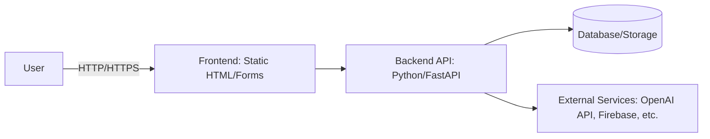

# 🧩 Threat Model — RiskShield Security Playground

## 🎯 Scope
The **RiskShield app** is a demo web application built with Python/Streamlit (update if needed) and used as a **security playground** for SAST (Semgrep), DAST (OWASP ZAP), and AppSec automation.  

### System Components
- **Frontend / Static pages** → HTML templates served to end users
- **Backend APIs** → Python/FastAPI endpoints (`api.py`, `backend.py`)
- **Database / Storage** → Local storage or cloud data store (if configured)
- **Authentication** → Login/registration forms in `/static/`
- **Third-party integrations** → (e.g., OpenAI API, Firebase config)

---

## 🗺️ Data Flow Diagram (DFD)

| Threat Category            | Description                              | Example in App                                     | Potential Impact                      | Mitigation                                  |
| -------------------------- | ---------------------------------------- | -------------------------------------------------- | ------------------------------------- | ------------------------------------------- |
| **Spoofing**               | Pretending to be another user or service | Weak login form in `static/login.html`             | Account takeover                      | Use MFA, secure session handling            |
| **Tampering**              | Modifying data or code                   | Unsanitized input passed to API                    | Data corruption, privilege escalation | Input validation, parameterized queries     |
| **Repudiation**            | Denying actions without audit trail      | No logging of login attempts                       | Difficult forensic analysis           | Centralized logging, signed logs            |
| **Information Disclosure** | Exposing sensitive data                  | Hardcoded API keys in HTML, verbose error messages | Credential theft, compliance risk     | Secrets in env vars, generic error messages |
| **Denial of Service**      | Overwhelming the app                     | Unthrottled login form                             | Service downtime                      | Rate limiting, WAF rules                    |
| **Elevation of Privilege** | Gaining more rights than intended        | Insecure role handling in backend                  | Unauthorized access                   | Enforce RBAC, secure session tokens         |

## 🛑 Abuse Cases
Abuse Case 1: Attacker injects malicious script in form input → Reflected XSS in dashboard.
Abuse Case 2: Hardcoded API key in static/*.html harvested → attacker abuses external service.
Abuse Case 3: Weak login form → brute-force attack → credential stuffing succeeds.
Abuse Case 4: Large file upload in uploads/ → disk exhaustion → DoS.

## ✅ Mitigations Implemented (or Planned)
 Move hardcoded secrets to .env + os.environ calls
 Add server-side input validation and sanitization
 Configure rate limiting and request size limits
 Enhance logging for authentication events
 Apply content security policy (CSP) headers

## 🧪 Security Test Plan
Test	|Tool	|Expected Outcome|
|-----|-----|----------------|
|Static code scan |	Semgrep	 | Identify insecure patterns (e.g., eval, weak crypto)|
|Dynamic scan	| OWASP ZAP	Report  | common vulns (XSS, SQLi, missing headers)|
|Dependency audit	| pip-audit, SBOM	| List outdated/vulnerable packages|
|Secrets detection	|trufflehog / git-secrets	| Ensure no secrets in repo|
|Manual abuse testing |	Burp Suite/Postman | Confirm exploitability of high-risk findings|

## 📌 Notes
This threat model is iterative. It will be updated as:
- New vulnerabilities are found in scans.
- New features are added to the app.
- Mitigations are implemented and verified.